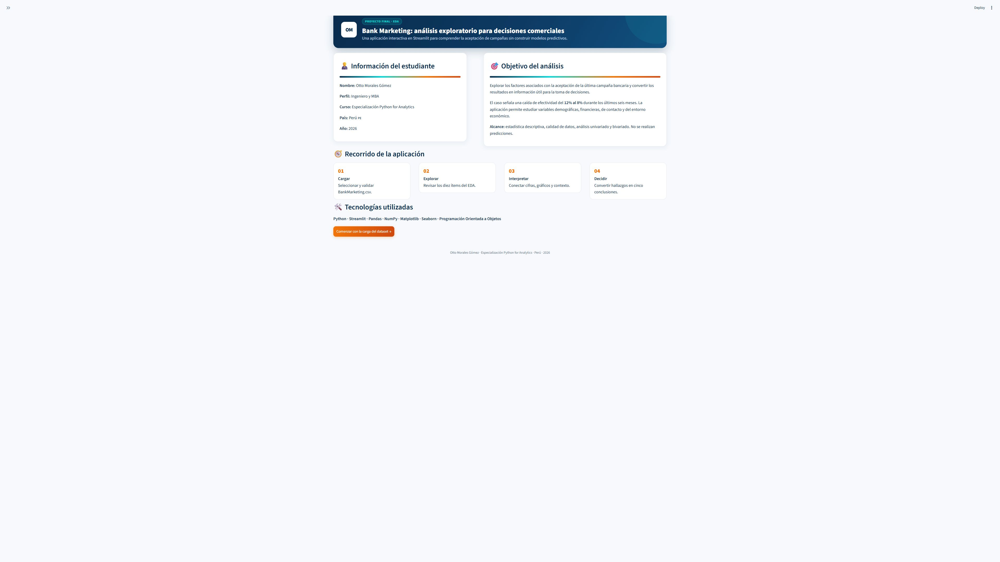
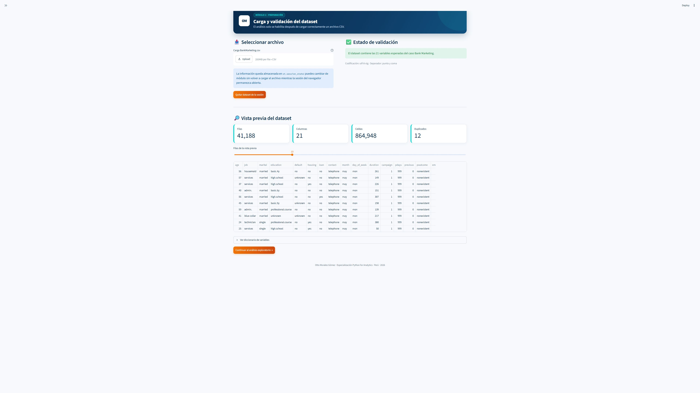
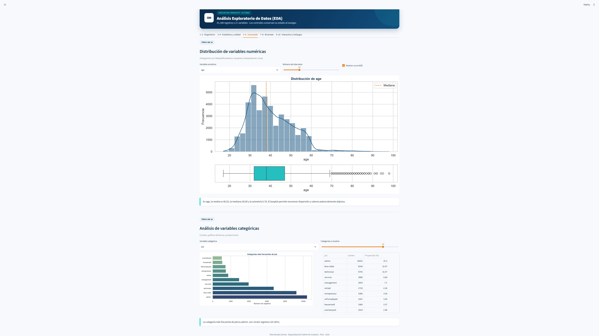

# Bank Marketing EDA - Aplicación interactiva en Streamlit

**Especialización Python for Analytics · Proyecto final de Análisis Exploratorio de Datos**

**Versión de la aplicación: V2.7.1**

| | |
|---|---|
| **Autor** | Otto Morales Gómez |
| **Perfil** | Ingeniero y MBA |
| **País** | Perú |
| **Año** | 2026 |
| **Aplicación** | [Abrir Bank Marketing EDA](https://evaluacionfinalottomorales.streamlit.app) |
| **Repositorio** | [OtroCoder/EvaluacionFinalOttoMorales](https://github.com/OtroCoder/EvaluacionFinalOttoMorales) |

## Descripción

Aplicación interactiva desarrollada con **Python y Streamlit** para realizar un Análisis Exploratorio de Datos (EDA) del dataset `BankMarketing.csv`. El proyecto estudia relaciones y comportamientos asociados con la aceptación de una campaña de marketing de una institución financiera.

El caso plantea que la efectividad comercial cayó del 12% al 8% durante los últimos seis meses. La aplicación ayuda a comprender el desempeño de la campaña mediante estadística descriptiva, visualizaciones y comparaciones de grupos. **No se construyen modelos predictivos.**

## Capturas de la aplicación

### Presentación y navegación



### Carga y validación del dataset



### Análisis exploratorio



## Funcionalidades principales

- Carga obligatoria del CSV mediante `st.file_uploader()`.
- Validación de codificación, separador y estructura del archivo.
- Persistencia del dataset y de los controles mediante `st.session_state`.
- Navegación mediante menú lateral, pestañas y columnas.
- Interfaz responsiva con identidad visual azul marino, turquesa y naranja.
- Clase `DataAnalyzer` para encapsular clasificación, estadísticas y visualizaciones.
- Interpretaciones automáticas redactadas en español.
- Descarga de las cinco conclusiones en formato de texto.
- Manejo diferenciado de valores nulos y de la categoría `unknown`.
- Detección de valores atípicos mediante Q1, Q3 y la regla de 1.5 veces el rango intercuartílico.
- Explorador configurable de correlaciones Pearson y Spearman.
- Hallazgos clave organizados con una evidencia visual etiquetada para cada conclusión.

## Diez ítems desarrollados

1. **Información general:** dimensiones, `.info()`, tipos de datos y valores nulos.
2. **Clasificación de variables:** identificación de variables numéricas y categóricas, con conteo y porcentaje de `unknown` por columna.
3. **Estadísticas descriptivas:** `.describe()`, media, mediana, moda y dispersión.
4. **Valores faltantes:** conteo, proporciones y discusión de valores `unknown`.
5. **Distribución numérica:** histogramas, KDE, interpretación de colas, boxplots, cuartiles, RIC y valores potencialmente atípicos.
6. **Variables categóricas:** conteos, gráficos de barras y proporciones.
7. **Numérico vs categórico:** comparación frente a `y`, con boxplots, Q1, mediana, Q3 y estadísticas por resultado de campaña.
8. **Categórico vs categórico:** barras porcentuales apiladas de `YES` y `NO`, ordenadas por tasa de aceptación.
9. **Análisis parametrizado:** selección dinámica de columnas, método Pearson o Spearman, mapa de calor y ranking de correlaciones.
10. **Hallazgos clave:** seis conclusiones ordenadas, cada una acompañada por su gráfico de respaldo y etiquetas de datos.

La aplicación incluye además un módulo independiente con **cinco conclusiones finales orientadas a la toma de decisiones**.

## Estructura del repositorio

```text
.
├── .streamlit/
│   └── config.toml              # Tema y configuración de Streamlit
├── docs/
│   └── capturas/                # Evidencias visuales para este README
├── .gitignore                   # Exclusiones de Git
├── app.py                       # Aplicación principal y clase DataAnalyzer
├── BankMarketing.csv            # Dataset del caso de estudio
├── README.md                    # Documentación del proyecto
└── requirements.txt             # Dependencias de Python
```

## Ejecución local

### 1. Clonar el repositorio

```bash
git clone https://github.com/OtroCoder/EvaluacionFinalOttoMorales.git
cd EvaluacionFinalOttoMorales
```

### 2. Crear y activar un entorno virtual

En Windows:

```bash
python -m venv .venv
.venv\Scripts\activate
```

En macOS o Linux:

```bash
python -m venv .venv
source .venv/bin/activate
```

### 3. Instalar las dependencias

```bash
pip install -r requirements.txt
```

### 4. Ejecutar la aplicación

```bash
streamlit run app.py
```

La aplicación se abrirá normalmente en `http://localhost:8501`.

### 5. Cargar el dataset

1. Entrar al módulo **Carga del dataset**.
2. Seleccionar `BankMarketing.csv`.
3. Verificar el mensaje de validación.
4. Continuar al módulo **Análisis EDA**.

## Despliegue en Streamlit Community Cloud

1. Subir todos los archivos del proyecto a un repositorio público de GitHub.
2. Ingresar a [Streamlit Community Cloud](https://streamlit.io/cloud).
3. Elegir **Create app** y conectar el repositorio.
4. Seleccionar la rama principal y definir `app.py` como archivo de inicio.
5. Confirmar el despliegue. Streamlit actualizará la aplicación cuando se publiquen nuevos cambios en la rama conectada.

Aplicación publicada: [evaluacionfinalottomorales.streamlit.app](https://evaluacionfinalottomorales.streamlit.app)

No se requieren secretos, bases de datos externas ni servicios adicionales.

## Descripción del dataset

El archivo contiene 41,188 observaciones y 21 variables:

| Variable | Descripción |
|---|---|
| `age` | Edad del cliente |
| `job` | Tipo de trabajo |
| `marital` | Estado civil |
| `education` | Nivel educativo |
| `default` | Crédito en mora |
| `housing` | Crédito hipotecario |
| `loan` | Crédito personal |
| `contact` | Canal de comunicación |
| `month` | Mes del último contacto |
| `day_of_week` | Día del último contacto |
| `duration` | Duración del contacto en segundos |
| `campaign` | Contactos realizados en la campaña actual |
| `pdays` | Días desde la última gestión; 999 indica que no hubo contacto previo |
| `previous` | Contactos previos a la campaña actual |
| `poutcome` | Resultado de la campaña anterior |
| `emp.var.rate` | Tasa de variación del empleo |
| `cons.price.idx` | Índice de precios al consumidor |
| `cons.conf.idx` | Índice de confianza del consumidor |
| `euribor3m` | Tasa Euribor a tres meses |
| `nr.employed` | Número de empleados |
| `y` | Resultado final: `yes` si aceptó y `no` si no aceptó |

## Hallazgos descriptivos reproducibles

Con el archivo incluido en este repositorio:

- La aceptación observada es aproximadamente **11.27%**: 4,640 aceptaciones de 41,188 registros.
- La mediana de `duration` es **449 segundos** en las aceptaciones y **163.50 segundos** en los rechazos; esta variable se conoce únicamente después del contacto.
- El canal `cellular` registra **14.74%** de aceptación, frente a **5.23%** en `telephone`.
- Los clientes con `poutcome = success` alcanzan **65.11%** de aceptación.
- Las aceptaciones tuvieron en promedio **2.05 contactos**, frente a **2.63** en los rechazos.
- El archivo no contiene valores nulos técnicos, pero `default` presenta **8,597 valores `unknown`**, equivalentes al **20.87%** de los registros.

Estos resultados describen asociaciones y **no demuestran causalidad**.

## Decisiones metodológicas

- `unknown` se conserva como categoría explícita para no ocultar problemas de calidad.
- `pdays = 999` se interpreta como ausencia de contacto previo.
- Los gráficos categóricos bivariados utilizan barras apiladas al 100% para comparar `YES` y `NO`, ordenadas por la tasa de `YES`.
- Los valores potencialmente atípicos se identifican con Q1, Q3 y 1.5 veces el RIC; no se eliminan automáticamente.
- El Ítem 9 permite seleccionar entre dos y seis columnas y comparar relaciones mediante Pearson o Spearman.
- Pearson representa relaciones lineales; Spearman resulta más resistente a asimetrías y valores extremos.
- Cada hallazgo del Ítem 10 se presenta junto con una visualización que respalda sus cifras.
- Las preferencias de los controles se respaldan en claves persistentes de `st.session_state` para conservarlas al cambiar de módulo.

## Tecnologías

- Python 3.10 o superior
- Streamlit
- Pandas
- NumPy
- Matplotlib
- Seaborn

---

Proyecto académico desarrollado por **Otto Morales Gómez** para la **Especialización Python for Analytics**, 2026.
